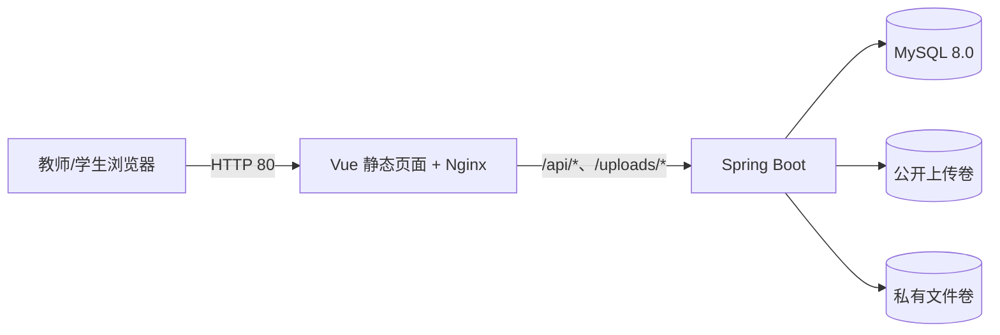

# CampusHub 云服务器部署

本目录用于把 CampusHub 部署到一台 Ubuntu 云服务器。部署结构为：



MySQL、公开上传文件和私有聊天/任务文件均使用 Docker Volume 持久化。数据库、后端端口不会直接暴露到公网。

## 1. 云服务器要求

- Ubuntu 22.04 LTS 或 24.04 LTS
- 建议至少 2 vCPU、2 GB 内存；内存较小时建议配置 Swap
- 安全组仅开放：
  - `22/TCP`：SSH，建议限制为自己的公网 IP
  - `80/TCP`：课程演示网站
- 不要开放 `3306` 和 `8080`

当前 Compose 配置为 1 GB 免费规格限制了 MySQL 缓冲池和 Java 堆内存；在 1 GB 机器上部署前仍应配置至少 4 GB Swap。

## 2. 安装 Docker

按照 Docker 官方 Ubuntu 安装文档安装 Docker Engine 与 Compose 插件。确认以下命令可用：

```bash
docker --version
docker compose version
```

## 3. 上传项目

推荐通过 Git 克隆仓库：

```bash
git clone <仓库地址> CampusHub
cd CampusHub
```

也可以将本地项目压缩后上传。不要上传 `backend/.env`、`frontend/.env` 或其他含密码的文件。

## 4. 创建生产配置

```bash
cp deploy/.env.example deploy/.env
chmod 600 deploy/.env
nano deploy/.env
```

至少替换：

- `DB_PASSWORD`
- `DB_ROOT_PASSWORD`
- `JWT_SECRET`

课程答辩没有 SMTP 服务时保留 `MAIL_DELIVERY_MODE=log`。生产配置文件不得提交到 Git。

## 5. 迁移现有数据库

### 5.1 在本地 Windows 导出

在 PowerShell 中执行，命令会提示输入当前 MySQL 密码：

```powershell
mysqldump.exe --single-transaction --routines --triggers --default-character-set=utf8mb4 --result-file=campus_hub-backup.sql -u root -p campus_hub
```

使用 `--result-file` 可以避免 Windows PowerShell 重定向改变 SQL 文件编码。

将 `campus_hub-backup.sql` 安全上传到服务器项目根目录。该备份可能包含账号和业务数据，不要提交到 Git。

如果还需要保留本地上传的图片和文件，将项目根目录的 `uploads/` 和 `uploads-private/` 一并上传到服务器。

### 5.2 在服务器启动 MySQL

```bash
docker compose --env-file deploy/.env -f deploy/compose.yml up -d db
docker compose --env-file deploy/.env -f deploy/compose.yml ps
```

等待 MySQL 状态变为 `healthy` 后导入备份：

```bash
docker compose --env-file deploy/.env -f deploy/compose.yml exec -T db \
  sh -c 'exec mysql -uroot -p"$MYSQL_ROOT_PASSWORD" "$MYSQL_DATABASE"' \
  < campus_hub-backup.sql
```

保留现有数据时不要执行 `database/01-schema.sql` 或 `database/02-seed.sql`。

### 5.3 恢复上传文件（如有）

先启动后端以创建上传卷：

```bash
docker compose --env-file deploy/.env -f deploy/compose.yml up -d backend
```

将服务器上的 `uploads/` 内容复制进持久卷：

```bash
docker compose --env-file deploy/.env -f deploy/compose.yml cp uploads/. backend:/app/uploads/
docker compose --env-file deploy/.env -f deploy/compose.yml cp uploads-private/. backend:/app/uploads-private/
docker compose --env-file deploy/.env -f deploy/compose.yml exec -u root backend \
  chown -R campushub:campushub /app/uploads /app/uploads-private
```

## 6. 构建并启动

```bash
docker compose --env-file deploy/.env -f deploy/compose.yml up -d --build
docker compose --env-file deploy/.env -f deploy/compose.yml ps
```

浏览器访问：

```text
http://<云服务器公网 IP>
```

健康检查：

```bash
curl http://127.0.0.1/health
```

## 7. 日志与更新

查看日志：

```bash
docker compose --env-file deploy/.env -f deploy/compose.yml logs -f --tail=200
```

代码更新后重新构建：

```bash
git pull
docker compose --env-file deploy/.env -f deploy/compose.yml up -d --build
```

停止服务但保留数据库和上传文件：

```bash
docker compose --env-file deploy/.env -f deploy/compose.yml down
```

不要使用 `down -v`，它会删除持久卷中的数据库和上传文件。

## 8. 备份

答辩前在服务器生成一次数据库备份：

```bash
docker compose --env-file deploy/.env -f deploy/compose.yml exec -T db \
  sh -c 'exec mysqldump -uroot -p"$MYSQL_ROOT_PASSWORD" --single-transaction "$MYSQL_DATABASE"' \
  > campus_hub-server-backup.sql
```

同时保留本地数据库备份。云端数据和本地数据不要只保留一份。

## 9. 答辩部署证据

建议截图并放入答辩材料：

1. 云服务器概览：公网 IP、Ubuntu 系统和实例规格，遮挡敏感信息。
2. `docker compose ps`：三个服务均正常运行，MySQL 为 `healthy`。
3. 公网 IP 打开的登录页和完整业务流程。
4. 数据库迁移前后关键表的记录数量。
5. 部署架构图和本目录中的 Compose/Nginx 配置。

答辩前一天完成一次完整演练，并保留本地运行方案作为现场网络异常时的备用方案。
