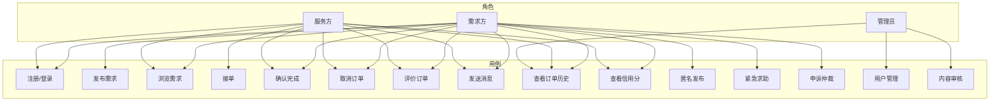

---

# 用例建模与AI辅助实验分析

**团队：** [暴风星云裂] | **日期：** 2026年4月19日

## 1. 系统级用例图

以下用例图覆盖 **3 个角色**（需求方、服务方、管理员）和 **15 个用例**。

### 用例清单（共15个）

| 编号 | 用例名称 | 涉及角色 |
|------|----------|----------|
| UC-01 | 注册/登录 | 需求方、服务方 |
| UC-02 | 发布需求 | 需求方 |
| UC-03 | 浏览需求 | 需求方、服务方 |
| UC-04 | 接单 | 服务方 |
| UC-05 | 确认完成 | 需求方、服务方 |
| UC-06 | 取消订单 | 需求方、服务方 |
| UC-07 | 评价订单 | 需求方、服务方 |
| UC-08 | 发送消息 | 需求方、服务方 |
| UC-09 | 查看订单历史 | 需求方、服务方、管理员 |
| UC-10 | 查看信用分 | 需求方、服务方 |
| UC-11 | 匿名发布 | 需求方 |
| UC-12 | 紧急求助 | 需求方 |
| UC-13 | 申诉仲裁 | 需求方、服务方 |
| UC-14 | 用户管理 | 管理员 |
| UC-15 | 内容审核 | 管理员 |

## 2. 核心用例详细描述（3个）

### 用例 UC-02：发布需求

| 项目 | 内容 |
|------|------|
| **用例编号** | UC-02 |
| **用例名称** | 发布需求 |
| **参与者** | 需求方 |
| **前置条件** | 1. 用户已登录 2. 账号未被禁用 3. 信用分 ≥ 0 |
| **后置条件** | 需求记录保存到数据库，状态为“进行中”，出现在公开列表中 |
| **基本流** | 1. 用户点击“发布需求”按钮 2. 系统显示发布表单，包含：标题、分类、描述、地点、期望完成时间、报酬（可选） 3. 用户填写所有必填项 4. 用户可选择是否匿名发布、是否标记紧急 5. 用户点击“提交” 6. 系统验证表单数据（标题非空、分类有效、地点非空） 7. 系统保存需求，生成唯一需求ID 8. 系统返回成功提示，并跳转到需求详情页 |
| **替代流** | **2a. 上传图片**：用户可在表单中上传最多3张图片（推荐用于二手交易）→ 系统存储图片链接并在详情页展示 **4a. 匿名发布**：用户勾选匿名 → 系统在需求详情页隐藏发布者昵称，显示“匿名用户” **4b. 紧急求助**：用户勾选紧急 → 系统添加“紧急”标签，列表页高亮显示，且30分钟内无接单则自动向附近用户推送通知 **6a. 验证失败**：若标题为空或分类无效 → 系统提示具体错误，返回表单让用户修改 **6b. 重复提交**：同一用户5分钟内重复提交相同标题 → 系统提示“请勿重复发布” |

### 用例 UC-04：接单

| 项目 | 内容 |
|------|------|
| **用例编号** | UC-04 |
| **用例名称** | 接单 |
| **参与者** | 服务方 |
| **前置条件** | 1. 用户已登录 2. 需求状态为“进行中” 3. 当前用户不是需求发布者 4. 当前用户信用分 ≥ 300 |
| **后置条件** | 订单记录创建，需求状态变为“已接单”，双方可开始聊天 |
| **基本流** | 1. 用户在需求列表或详情页点击“接单”按钮 2. 系统检查需求是否已被他人接单 3. 系统检查用户信用分是否达标 4. 系统将需求状态改为“已接单”，记录接单用户ID 5. 系统自动创建订单记录，状态为“待确认” 6. 系统发送站内消息通知需求方：“您的需求已被 [接单者昵称] 接单” 7. 系统跳转到订单详情页 |
| **替代流** | **2a. 需求已被接单**：系统提示“该需求已被其他用户接单”，禁用接单按钮 **3a. 信用分不足**：系统提示“您的信用分低于300，无法接单”，并引导用户查看信用分规则 **3b. 用户已被封禁**：系统提示“您的账号已被封禁，无法接单” **6a. 需求方30分钟内未确认开始**：系统自动取消订单，恢复需求状态为“进行中”，并通知双方 |

### 用例 UC-07：评价订单

| 项目 | 内容 |
|------|------|
| **用例编号** | UC-07 |
| **用例名称** | 评价订单 |
| **参与者** | 需求方、服务方 |
| **前置条件** | 1. 订单状态为“已完成” 2. 当前用户未对该订单进行过评价 |
| **后置条件** | 评价记录保存，对方信用分更新，订单状态变为“已评价” |
| **基本流** | 1. 用户在“我的订单-已完成”列表中找到目标订单，点击“评价”按钮 2. 系统显示评价表单：1-5星评分滑块、文字输入框（可选）、匿名评价复选框 3. 用户选择星级，填写评语（可选） 4. 用户决定是否勾选“匿名评价” 5. 用户点击“提交” 6. 系统保存评价记录 7. 系统根据评分更新对方信用分：    - 信用分变化 = (评分 - 3) × 10    - 若匿名评价，权重减半（即变化值 × 0.5） 8. 系统发送评价通知给对方 |
| **替代流** | **3a. 差评（1-2星）**：系统强制要求填写评语（至少10个字符），否则无法提交 **4a. 匿名评价**：系统在评价详情页隐藏评价者昵称 **6a. 对方信用分更新触发等级变化**：系统记录等级变动日志，并在用户下次登录时提示 **6b. 信用分低于300**：系统自动将对方账号状态改为“冻结”，并发送通知 |

## 3. AI辅助实验分析

> **对应任务3.3要求：** 让 AI 生成用例和用户故事，与人工版本对比。重点关注，并举例回答：AI 生成的内容是否遗漏了异常流？验收标准是否具体可测试？

### 3.1 实验设置

- **AI工具：** ChatGPT-4 
- **Prompt：** “请为校园互助平台生成接单、发布需求、评价订单三个核心用例的详细描述，包含前置条件、基本流、替代流、后置条件。”
- **人工版本：** 基于调研结果和团队讨论撰写的上述版本。

### 3.2 异常流遗漏对比

**AI生成的接单用例替代流（节选）：**
> - 替代流1：需求不存在或已关闭 → 提示错误
> - 替代流2：用户未登录 → 跳转登录页

**人工版本替代流（见UC-04）：**
> - 2a. 需求已被接单 → 提示
> - 3a. 信用分不足 → 提示并引导
> - 3b. 用户被封禁 → 提示
> - 6a. 需求方30分钟未确认 → 自动取消订单

**遗漏清单：**

| 异常场景 | AI是否覆盖 | 人工是否覆盖 | 说明 |
|----------|-----------|-------------|------|
| 接单方信用分低于阈值 | ❌ | ✅ | AI未考虑信用分约束 |
| 接单方账号被封禁 | ❌ | ✅ | AI未检查账号状态 |
| 需求方超时未确认 | ❌ | ✅ | AI无超时处理逻辑 |
| 并发接单冲突 | ❌ | ✅（通过状态检查隐含） | AI未处理竞态条件 |

**结论：** AI生成的用例**遗漏了多个关键异常流**，尤其是与业务规则（信用分）、超时机制相关的场景。AI倾向于描述理想路径，对实际运营中高频出现的异常缺乏建模。

### 3.3 验收标准可测试性对比

虽然验收标准通常属于用户故事，但用例的前置/后置条件也需可测试。以下对比：

| 维度 | AI生成示例 | 人工版本示例 | 可测试性评价 |
|------|-----------|-------------|-------------|
| 前置条件 | “用户已登录” | “用户已登录且信用分≥300” | AI无法测试边界值；人工可设计用例：信用分299 vs 300 |
| 后置条件 | “订单状态改变” | “订单状态变为‘已接单’，双方可开始聊天” | AI的“改变”模糊；人工的“变为已接单”可断言 |
| 替代流触发 | “如果出错” | “需求方30分钟内未确认开始” | AI的“出错”无法量化；人工的“30分钟”可自动化测试 |

**具体例子：**
- **AI不可测试：** “系统应在合理时间内处理接单请求” → “合理时间”未定义
- **人工可测试：** “接单请求响应时间≤500ms（95分位）” → 可用JMeter验证

### 3.4 人工修正总结

| 问题类型 | AI输出 | 人工修正 | 修正方法 |
|----------|--------|----------|----------|
| 遗漏异常流 | 无信用分检查 | 增加“信用分≥300”前置条件 | 走查业务流程 |
| 模糊条件 | “用户状态正常” | “账号未被禁用且信用分≥300” | 具体化状态值 |
| 缺失超时 | 无 | 增加“30分钟未确认→自动取消” | 参考同类平台 |
| 不可测试 | “及时通知” | “3秒内发送站内消息” | 添加性能指标 |

## 4. 用例与需求追溯矩阵

| 用例编号 | 对应功能需求 |
|----------|--------------|
| UC-01 | UR-01, UR-02 |
| UC-02 | DR-01, DR-02, DR-03, DR-05 |
| UC-03 | DR-04 |
| UC-04 | OR-01 |
| UC-05 | OR-02 |
| UC-06 | OR-03 |
| UC-07 | CR-01, CR-02, CR-03, CR-04 |
| UC-08 | MN-02 |
| UC-09 | OR-04 |
| UC-10 | CR-03 |
| UC-11 | DR-02 |
| UC-12 | DR-03 |
| UC-13 | OR-03 |
| UC-14 | AD-01 |
| UC-15 | AD-02 |

---
