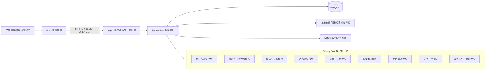
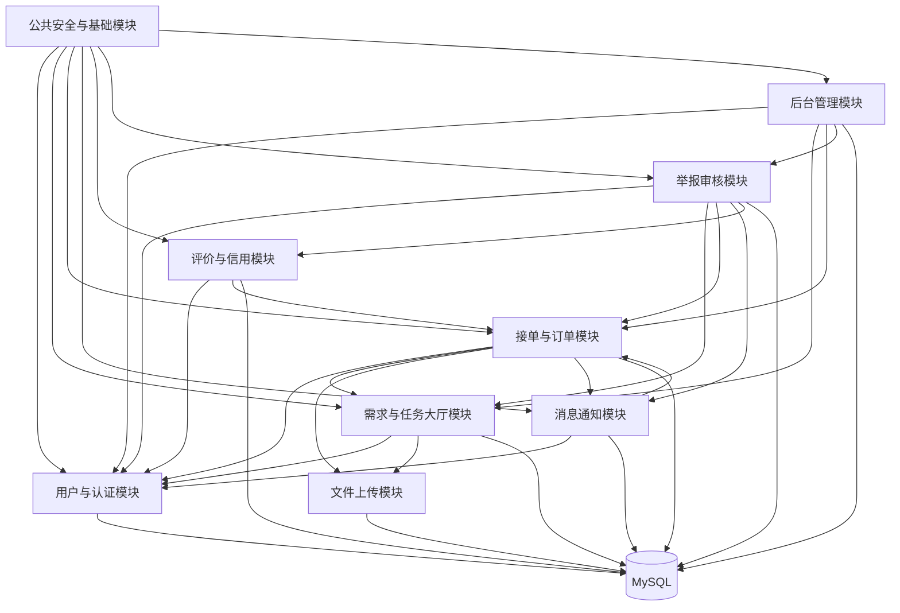
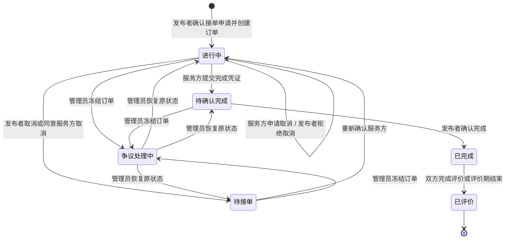
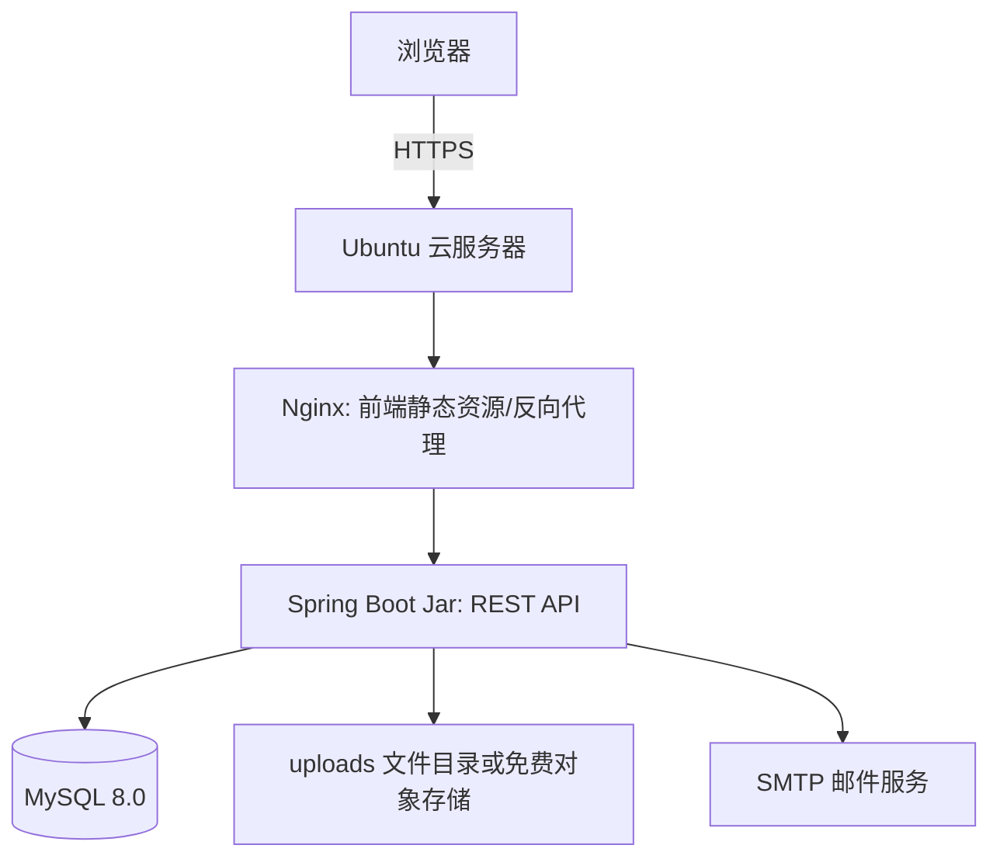

# CampusHub 体系结构设计文档

**团队：** 暴风星云裂 | **项目：** CampusHub | **日期：** 2026年4月29日  
**选定架构：** 前后端分离的分层单体架构

## 1. 架构概览

CampusHub 采用主流 Web 应用架构：前端 Vue3 单页应用通过 HTTPS 调用后端 Spring Boot RESTful API，并通过 WebSocket 使用订单内实时文字和图片聊天；后端按业务模块和分层结构组织，统一访问 MySQL 8.0。MVP 阶段不引入 Redis、消息队列、网关、搜索引擎等额外中间件。

### 1.1 总体架构图



### 1.2 架构分层

| 层次 | 职责 | 主要技术 |
|------|------|----------|
| 表现层 | 页面展示、表单交互、路由控制、前端权限控制 | Vue3、TypeScript、Vite、Vue Router、Pinia、Element Plus |
| 接口层 | 接收 HTTP 请求、参数校验、统一响应、异常转换 | Spring MVC、Bean Validation |
| 业务层 | 处理业务规则、订单状态流转、权限判断、事务边界 | Spring Boot Service、Spring Transaction |
| 数据访问层 | 封装 SQL、分页、索引查询、实体映射 | MyBatis-Plus、MySQL Driver |
| 持久层 | 存储用户、需求、订单、消息、评价、举报、公告等数据 | MySQL 8.0 |
| 基础设施层 | 鉴权、日志、文件上传、邮件发送、定时任务 | Spring Security、JWT、Spring Mail、Spring Task |

## 2. 模块划分

### 2.1 后端模块职责

| 模块 | 职责边界 | 主要数据 |
|------|----------|----------|
| 用户与认证模块 | 注册、登录、退出登录、学校邮箱验证、忘记密码与邮箱验证码重置、连续登录失败锁定、校园身份认证、认证标识展示、个人资料维护、常用校区与联系方式维护、联系方式展示开关、敏感信息脱敏、账号注销与个人信息匿名化、角色与权限、账号禁用状态判断 | user、user_profile、verification_code |
| 需求与任务大厅模块 | 8 类需求发布、通用字段与分类差异化字段校验、匿名发布、发布内容关键词过滤、未接单需求编辑/删除、需求过期处理、公开需求浏览、需求详情、分类/校区/发布时间筛选、关键词搜索、最新发布/截止时间排序、需求收藏、取件码等敏感字段可见性控制 | task、task_category、task_image、favorite |
| 接单与订单模块 | 接单申请、发布者查看申请并确认服务方、订单创建、订单状态流转、接单并发冲突控制、完成凭证提交、发布者确认完成、接单前取消、接单后协商取消、24 小时未处理自动取消、订单历史查询、争议与仲裁入口、取消率等履约规则记录 | application、order、order_status_log |
| 消息通知模块 | 接单申请通知、订单状态变更通知、评价通知、举报处理结果通知、订单内实时文字和图片聊天、未读消息数量、消息已读/删除、消息内容关键词过滤、WebSocket 连接鉴权与消息推送 | notification、order_message |
| 评价与信用模块 | 订单完成后 7 天内双向评分和文字评价、信用分初始值与加减分规则、低信用分发布/接单限制、个人主页信用分与近 3 个月评价展示、恶意评价申诉入口、频繁取消订单对信用的影响记录 | review、credit_log |
| 举报审核模块 | 违规需求、不当评价、用户行为举报，举报类型与描述记录，证据材料关联，管理员人工审核，删除内容/警告/禁言/封号/信用扣分等处罚，举报结果通知，被举报用户申诉处理 | report、appeal、punishment |
| 后台管理模块 | 管理员登录后的用户列表与搜索、禁用/解禁用户、需求和订单列表筛选、违规需求下架、违规订单冻结、举报处理、系统公告发布、基础运行概览、管理员操作审计 | admin_operation_log、announcement |
| 文件上传模块 | 用户头像、需求配图、失物招领图片、二手商品图片、订单完成凭证、举报/仲裁证据图片上传；校验文件大小和类型，压缩图片并返回可访问 URL | file_record |
| 公共安全与基础模块 | JWT 鉴权、角色权限、统一异常、统一响应、操作日志、敏感词配置、枚举与工具类、分页规范、输入校验、SQL 注入/XSS/CSRF 防护支撑 | shared config |

### 2.2 前端模块职责

| 模块 | 页面/功能 |
|------|-----------|
| 用户入口 | 登录、注册、退出登录、邮箱验证、找回密码、认证状态提示 |
| 任务大厅 | 首页列表、分类筛选、校区筛选、关键词搜索、排序、需求详情、需求收藏 |
| 发布需求 | 需求类别选择、差异化表单、图片上传、匿名发布 |
| 我的订单 | 我的发布、我的接单、订单详情、状态操作、完成凭证、取消/仲裁入口 |
| 消息中心 | 系统通知、订单内实时文字和图片聊天、未读提示、已读/删除 |
| 评价信用 | 提交评价、查看信用分、评价记录、恶意评价申诉 |
| 举报申诉 | 举报表单、举报记录、举报处理结果、申诉入口 |
| 后台管理 | 数据概览、用户管理、需求管理、订单管理、举报处理、公告管理、操作审计 |

### 2.3 模块依赖图



依赖原则：

- Controller 只调用本模块或应用服务接口，不直接访问数据库。
- 订单状态变更统一由 OrderService 处理，其他模块不得直接修改订单状态字段。
- 管理后台通过各模块公开的服务接口完成管理动作，不绕过业务规则直接改表。
- 消息通知作为副作用由业务服务调用 NotificationService 写入数据库，不使用消息队列；订单内聊天由 ChatService 写入消息表后通过 WebSocket 推送给订单双方。

### 2.4 P1 需求到模块职责追踪

| P1 需求范围 | 需求编号/用户故事 | 对应模块职责 |
|-------------|-------------------|--------------|
| 用户注册与登录 | FR-UL-001 ~ FR-UL-005、US-01 | 用户与认证模块；前端用户入口；公共安全模块 |
| 学生身份认证 | FR-AU-001 ~ FR-AU-004 | 用户与认证模块；用户入口；公共安全模块 |
| 用户资料管理 | FR-PR-001 ~ FR-PR-006 | 用户与认证模块；评价与信用模块；文件上传模块 |
| 需求发布与分类差异化 | FR-PO-001 ~ FR-PO-010、US-02、US-04、US-05 | 需求与任务大厅模块；文件上传模块；公共安全模块 |
| 任务大厅与搜索浏览 | FR-HL-001 ~ FR-HL-006、US-03、US-14 | 需求与任务大厅模块；消息通知模块负责紧急需求提醒的后续扩展 |
| 接单与订单管理 | FR-OR-001 ~ FR-OR-008、US-11、US-15 | 接单与订单模块；评价与信用模块；举报审核模块 |
| 消息与通知 | FR-MSG-001 ~ FR-MSG-005、US-07、US-08、US-12 | 消息通知模块；用户与认证模块负责黑名单关系；文件上传模块支撑图片消息 |
| 评价与信用体系 | FR-EC-001 ~ FR-EC-005、US-06、US-09 | 评价与信用模块；举报审核模块处理恶意评价申诉 |
| 举报与审核 | FR-REP-001 ~ FR-REP-005、US-10 | 举报审核模块；后台管理模块；消息通知模块 |
| 基础后台管理 | FR-AD-001 ~ FR-AD-006 | 后台管理模块；用户与认证模块；公共安全模块 |
| 明确不做的功能 | P1 明确剔除项、US-13 Won't | 不进入 MVP 模块职责；仅在架构演进计划中保留可能性 |

## 3. 接口设计

### 3.1 接口风格

- **调用方式：** HTTPS + RESTful API；订单内实时聊天使用 WebSocket。
- **数据格式：** JSON；文件上传使用 multipart/form-data。
- **认证方式：** 登录成功后返回 JWT，前端通过 `Authorization: Bearer <token>` 调用受保护接口。
- **统一响应：**

```json
{
  "code": 0,
  "message": "success",
  "data": {},
  "traceId": "20260429-xxxx"
}
```

- **错误响应：**

```json
{
  "code": 40001,
  "message": "当前用户未完成校园身份认证",
  "data": null,
  "traceId": "20260429-xxxx"
}
```

### 3.2 核心 API 示例

| 模块 | 方法 | 路径 | 说明 |
|------|------|------|------|
| 用户认证 | POST | `/api/auth/register` | 学校邮箱注册 |
| 用户认证 | POST | `/api/auth/login` | 登录并返回 JWT |
| 用户认证 | POST | `/api/auth/verify-email` | 邮箱验证码验证 |
| 用户资料 | GET | `/api/users/me` | 获取当前用户资料 |
| 用户资料 | PATCH | `/api/users/me` | 修改个人资料 |
| 需求 | GET | `/api/tasks` | 任务大厅列表，支持分类、校区、关键词、排序、分页 |
| 需求 | POST | `/api/tasks` | 发布需求 |
| 需求 | GET | `/api/tasks/{taskId}` | 查看需求详情 |
| 需求 | PATCH | `/api/tasks/{taskId}` | 编辑未接单需求 |
| 接单 | POST | `/api/tasks/{taskId}/applications` | 发起接单申请 |
| 接单 | POST | `/api/applications/{applicationId}/confirm` | 发布者确认接单 |
| 订单 | GET | `/api/orders` | 查询我的发布/接单订单 |
| 订单 | GET | `/api/orders/{orderId}` | 查看订单详情 |
| 订单 | POST | `/api/orders/{orderId}/messages` | 发送订单内文字消息 |
| 订单 | POST | `/api/orders/{orderId}/messages` | 发送订单内文字或图片消息 |
| 订单 | WS | `/ws/orders/{orderId}/chat` | 订单双方实时接收文字和图片消息事件 |
| 订单 | POST | `/api/orders/{orderId}/complete` | 服务方提交完成凭证 |
| 订单 | POST | `/api/orders/{orderId}/confirm-completion` | 发布者确认完成 |
| 评价 | POST | `/api/orders/{orderId}/reviews` | 提交订单评价 |
| 举报 | POST | `/api/tasks/{taskId}/reports` | 提交任务举报 |
| 举报 | POST | `/api/users/{userId}/reports` | 提交用户举报 |
| 通知 | GET | `/api/notifications` | 查询通知列表 |
| 通知 | PATCH | `/api/notifications/{notificationId}/read` | 标记已读 |
| 文件 | POST | `/api/files/upload` | 上传头像、需求图片、完成凭证、聊天图片、举报证据 |
| 后台 | GET | `/api/admin/users` | 管理员查询用户 |
| 后台 | PATCH | `/api/admin/users/{userId}/status` | 禁用/解禁用户 |
| 后台 | GET | `/api/admin/reports` | 查询举报列表 |
| 后台 | PATCH | `/api/admin/reports/{reportId}` | 处理举报 |

### 3.3 模块间接口

| 调用方 | 被调用方 | 调用方式 | 数据格式 | 说明 |
|--------|----------|----------|----------|------|
| 需求模块 | 用户模块 | Java Service 接口 | DTO/Entity | 校验用户是否认证、是否被禁用 |
| 需求模块 | 文件模块 | Java Service 接口 | FileUploadResult | 保存需求配图元数据 |
| 订单模块 | 需求模块 | Java Service 接口 | TaskSnapshot | 校验需求是否可接单，并锁定需求状态 |
| 订单模块 | 消息通知模块 | Java Service 接口 | NotificationCommand | 接单、完成、取消等状态变更后写入通知 |
| 消息通知模块 | 文件模块 | Java Service 接口 | FileUploadResult | 发送图片消息时保存图片并关联消息记录 |
| 评价模块 | 订单模块 | Java Service 接口 | OrderSummary | 校验订单是否已完成且未重复评价 |
| 评价模块 | 用户模块 | Java Service 接口 | CreditChangeCommand | 更新信用分并记录信用流水 |
| 举报模块 | 需求/订单/消息/评价模块 | Java Service 接口 | ReportTargetSnapshot | 获取被举报对象快照，便于管理员审核 |
| 后台模块 | 各业务模块 | Java Service 接口 | AdminCommand | 执行禁用、下架、冻结、处理举报等管理动作 |

## 4. 关键业务设计

### 4.1 订单状态流转



状态流转规则：

- 所有状态变更必须在事务中完成。
- 状态变更前校验操作者身份、订单当前状态和业务条件。
- 每次状态变更写入 `order_status_log`，用于追踪和测试。
- 接单确认时对需求记录加行级锁或乐观锁，避免多人同时接走同一任务。

### 4.2 通知与实时聊天

MVP 阶段实现订单内实时聊天，但范围只限订单双方的文字和图片消息；不做语音/视频通话、群聊、位置共享、消息撤回等复杂功能，也不引入 Redis 或消息队列：

- 系统通知写入 `notification` 表。
- 订单内文字和图片消息写入 `order_message` 表，图片文件由文件上传模块保存，消息表只保存图片 URL 和元数据。
- 订单详情页打开时建立 `/ws/orders/{orderId}/chat` WebSocket 连接，后端校验用户必须是订单双方之一。
- 一方发送文字或图片消息后，后端先落库，再通过 WebSocket 推送给另一方和发送方当前页面。
- 系统通知和未读数量仍可通过 HTTP 轮询实现，降低复杂度。
- 关键操作完成后同步返回结果，不依赖异步消息保证业务完成。

### 4.3 搜索与筛选

MVP 阶段不引入 Elasticsearch：

- 任务大厅通过 MySQL 索引支持分类、校区、状态、发布时间、截止时间筛选。
- 关键词搜索首版使用标题和描述字段的 LIKE 查询；数据量增长后再考虑 MySQL FULLTEXT 或搜索服务。
- 所有列表接口必须分页，默认每页 20 条。

### 4.4 文件上传

- 支持头像、需求配图、订单完成凭证。
- 上传接口校验文件类型、大小和数量。
- 文件可存储在服务器本地目录或免费对象存储，数据库只保存 URL、文件名、大小、上传者、业务归属。
- 取件码等敏感信息不得以图片 OCR 或公开字段方式暴露，只在订单确认后向接单者展示。

## 5. 技术选型

| 层次 | 选择 | 选择理由 |
|------|------|----------|
| 前端框架 | Vue3 + TypeScript + Vite | 主流、轻量、开发体验好，适合单页应用和学生团队快速开发。 |
| 前端路由 | Vue Router | Vue 官方路由方案，支持前台和后台路由权限控制。 |
| 前端状态管理 | Pinia | Vue3 官方推荐状态管理库，适合保存登录态、用户信息、未读数量等。 |
| UI 组件库 | Element Plus | Vue3 生态成熟，表单、表格、弹窗、后台管理组件完善。 |
| HTTP 客户端 | Axios | 拦截器方便统一处理 JWT、错误提示和请求日志。 |
| 后端语言 | Java 17 | 稳定、主流，适合 Spring Boot 生态。 |
| 后端框架 | Spring Boot 3.x | 主流 Java Web 框架，快速构建 RESTful API，生态完善。 |
| Web 框架 | Spring MVC | 与 Spring Boot 集成良好，适合 Controller-Service-Mapper 分层。 |
| 安全框架 | Spring Security + JWT | 满足登录鉴权、角色权限和接口保护需求。 |
| 数据访问 | MyBatis-Plus | 在国内 Java 项目中常用，简化 CRUD，同时保留 SQL 可控性。 |
| 数据库 | MySQL 8.0 | P1 已确定；主流、易部署、适合结构化业务数据和事务。 |
| 邮件 | Spring Mail + 学校/第三方 SMTP | 满足邮箱验证和密码重置，不引入短信服务。 |
| API 文档 | springdoc-openapi/Swagger UI | 自动生成接口文档，便于前后端联调和验收。 |
| 实时聊天 | Spring WebSocket | 用于订单内文字和图片消息实时推送，不需要外部消息队列。 |
| 定时任务 | Spring Task | 处理需求过期、订单超时提醒等轻量定时任务，不引入调度中间件。 |
| 中间件（缓存） | 不采用 Redis | 当前性能目标可通过索引、分页和本地事务满足，避免缓存一致性和部署成本。 |
| 中间件（消息队列） | 不采用 RabbitMQ/Kafka | 订单聊天由单体应用内 WebSocket 推送，系统通知量小，用数据库通知表 + 轮询即可满足 MVP。 |
| 中间件（网关） | 不采用 API Gateway | 单体后端无需网关，Nginx 只负责静态资源和反向代理。 |
| 搜索引擎 | 不采用 Elasticsearch | 首版数据规模小，MySQL 索引和 LIKE/FULLTEXT 足够。 |
| 部署方式 | 单台 Ubuntu 服务器：Nginx + Spring Boot Jar + MySQL | 运维成本低，符合免费云服务器和学生项目约束。 |

## 6. 质量属性设计

| 质量属性 | 设计措施 |
|----------|----------|
| 可维护性 | 模块化单体，按业务包划分；Controller、Service、Mapper 分层；统一 DTO 和异常处理。 |
| 安全性 | Spring Security + JWT；BCrypt 存储密码；敏感信息脱敏；管理员操作审计。 |
| 可靠性 | 订单状态流转使用事务；关键状态变更写日志；上传失败给出重试提示。 |
| 性能 | 分页查询、必要索引、避免 N+1 查询；首屏资源由 Nginx 提供。 |
| 可测试性 | 业务规则集中在 Service；订单状态流转可用单元测试和接口测试覆盖。 |
| 可扩展性 | 模块间通过服务接口协作；后续可拆分通知、聊天、文件、搜索等非核心模块。 |

## 7. 部署视图



部署说明：

- 前端执行 `npm run build` 后将产物部署到 Nginx 静态目录。
- 后端打包为 Spring Boot Jar，由 systemd 或简单脚本守护启动。
- MySQL 与后端同机部署或使用免费云数据库，需定期备份。
- Nginx 负责 HTTPS、静态资源、反向代理 `/api` 到后端。

## 8. 架构演进计划

首版不提前引入复杂架构，但保留以下演进路径：

1. **性能不足时：** 先优化 SQL、索引和分页，再考虑 Redis 缓存热点任务列表。
2. **聊天与通知压力增大时：** 先优化 WebSocket 连接管理和消息分页；如后续多实例部署，再考虑 Redis Pub/Sub 或消息队列做跨实例消息分发。
3. **搜索需求增强时：** 从 MySQL LIKE/FULLTEXT 演进到 Elasticsearch。
4. **文件量增大时：** 从本地目录迁移到对象存储。
5. **团队规模扩大时：** 优先拆出文件服务、通知服务、搜索服务，核心订单模块保持强一致。
