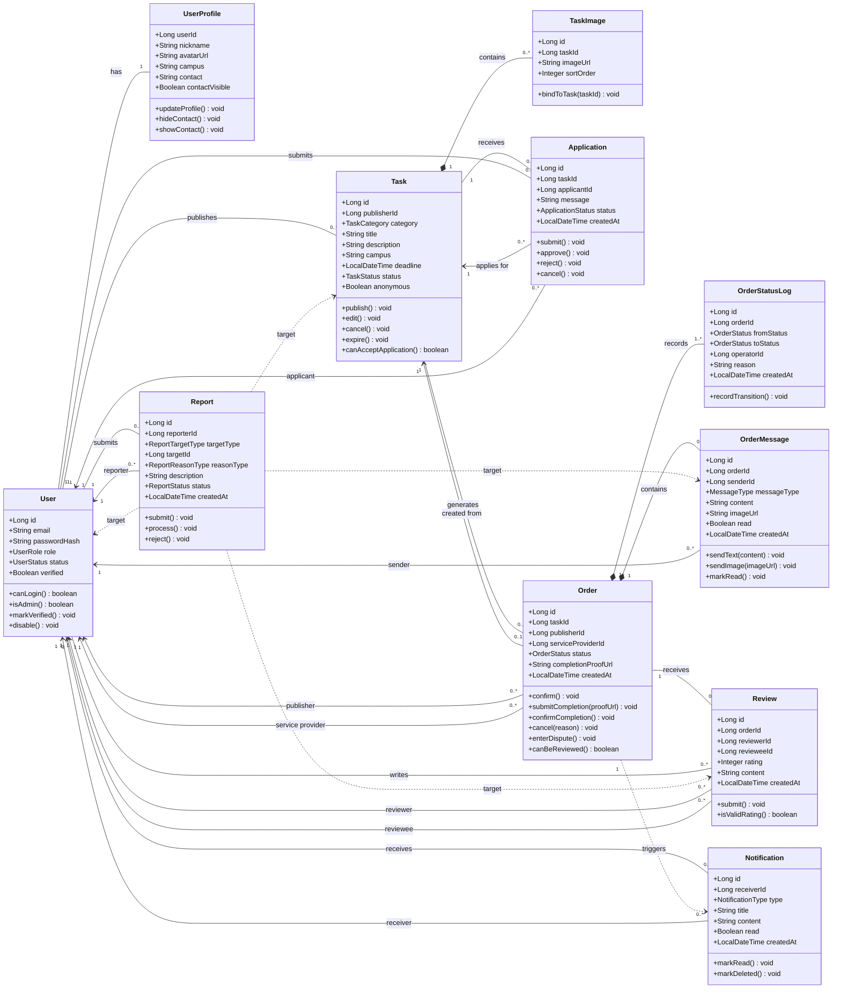

# CampusHub 类图

**阶段：** P3 详细设计  
**范围：** 核心业务类图（MVP 首版）

## 1. 设计范围说明

本类图围绕 CampusHub 的核心业务闭环展开：

`用户注册登录 -> 发布需求 -> 接单申请 -> 形成订单 -> 订单内交流 -> 完成订单 -> 提交评价 -> 发起举报`

本图优先覆盖 P1/P2 已确定的核心模块，不在第一版类图中展开验证码、收藏、公告、申诉、处罚、黑名单等扩展对象，以保证结构清晰、重点突出。

## 2. 核心类图

## 3. 关系说明

- `User` 是平台参与者核心，负责发布需求、申请接单、发送消息、提交评价与举报。
- `Task` 是需求发布对象，`Application` 表示接单申请，申请被确认后生成 `Order`。
- `Order` 是执行主线中心对象，状态变化写入 `OrderStatusLog`，沟通消息写入 `OrderMessage`。
- `Notification` 与 `OrderMessage` 不同：前者是系统通知，后者是订单内聊天消息。
- `Review` 表示订单完成后的双向评价，`Report` 表示对任务、消息、评价或用户行为的举报。

## 4. 第一版取舍说明

本版类图优先突出主业务骨架，因此未纳入以下扩展类：

- `VerificationCode`
- `Favorite`
- `CreditLog`
- `Appeal`
- `Punishment`
- `Announcement`
- `FileRecord`
- `BlacklistRelation`

这些对象可在后续子类图或扩展类图中补充。
