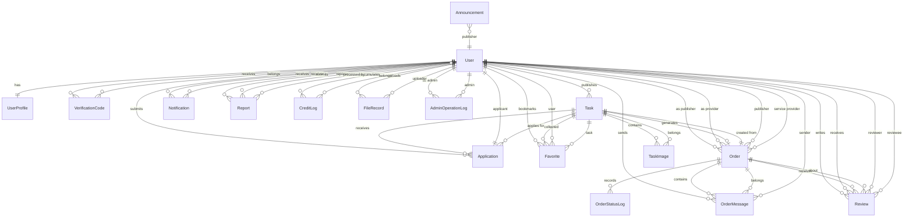

# CampusHub ER 图与数据库设计

**阶段：** P3 详细设计  

---

## 1. 设计说明

本 ER 图基于 [01-class-diagram.md](01-class-diagram.md) 中的核心类图，将面向对象的类模型映射为关系数据库模型。映射遵循以下原则：

- 每个类映射为一张表，类属性映射为表字段
- 1:1 关系通过外键实现（`User` ← `UserProfile`）
- 1:N 关系通过多方持有一方主键实现
- M:N 关系（如收藏）通过中间表实现
- 枚举类型映射为 VARCHAR 约束

另外，根据 API 规范中实际需要的功能，补充类图中标记为"扩展"但 MVP 必需的表：`verification_code`、`favorite`、`credit_log`、`file_record`、`announcement`、`admin_operation_log`。

## 2. ER 图

## 3. 表结构说明

### 3.1 用户相关

| 表名 | 对应类 | 说明 |
|------|--------|------|
| `user` | User | 用户认证与状态核心表 |
| `user_profile` | UserProfile | 用户资料表，1:1 关联 user |
| `verification_code` | —（扩展） | 邮箱验证码，注册/密码重置使用 |

**设计选择：** `user` 与 `user_profile` 保持分离，与类图 1:1 关系一致。实际查询中多数场景需要 JOIN，但分离有利于敏感字段（password_hash）与展示字段隔离。

### 3.2 需求相关

| 表名 | 对应类 | 说明 |
|------|--------|------|
| `task` | Task | 需求/任务核心表 |
| `task_image` | TaskImage | 需求配图，1:N |
| `favorite` | —（扩展） | 用户收藏需求关联表 |

**分类差异化字段处理：** 采用 JSON 列 `category_fields` 存储各分类的专属字段，避免宽表大量 NULL 列，保持主体结构稳定。MV P 阶段不需对 JSON 内部字段建索引。

### 3.3 订单相关

| 表名 | 对应类 | 说明 |
|------|--------|------|
| `orders` | Order | 订单核心表（避免 `order` 保留字） |
| `order_status_log` | OrderStatusLog | 订单状态流转日志 |
| `order_message` | OrderMessage | 订单内聊天消息 |

### 3.4 评价与信用

| 表名 | 对应类 | 说明 |
|------|--------|------|
| `review` | Review | 订单评价 |
| `credit_log` | —（扩展） | 信用分变动流水 |

### 3.5 举报与通知

| 表名 | 对应类 | 说明 |
|------|--------|------|
| `report` | Report | 用户举报 |
| `notification` | Notification | 系统通知 |

### 3.6 基础设施

| 表名 | 对应类 | 说明 |
|------|--------|------|
| `file_record` | —（扩展） | 文件上传记录 |
| `announcement` | —（扩展） | 系统公告 |
| `admin_operation_log` | —（扩展） | 管理员操作审计 |

## 4. 索引设计

### 4.1 设计原则

1. **主键索引：** 每表默认以 `id` 为聚簇索引
2. **外键索引：** 所有外键列建立普通索引，加速 JOIN
3. **查询索引：** 根据 API 规范中的高频查询路径建立联合索引
4. **唯一索引：** 业务唯一约束（邮箱、收藏去重、评价去重）
5. **避免过度索引：** MVP 数据量小（预计 <10 万行/表），不提前建覆盖索引

### 4.2 索引清单

| 表 | 索引名 | 列 | 类型 | 用途 |
|----|--------|-----|------|------|
| user | `uk_email` | email | UNIQUE | 登录/注册时邮箱查重 |
| user | `idx_user_status` | status | NORMAL | 管理员筛选用户状态 |
| user_profile | `idx_profile_user_id` | user_id | UNIQUE | JOIN user |
| verification_code | `idx_vc_email_code` | email, code | NORMAL | 校验验证码 |
| verification_code | `idx_vc_expires` | expires_at | NORMAL | 定期清理过期记录 |
| task | `idx_task_publisher` | publisher_id | NORMAL | "我发布的"列表 |
| task | `idx_task_hall` | status, category, campus | NORMAL | 任务大厅多条件筛选 |
| task | `idx_task_sort_latest` | status, created_at | NORMAL | 按最新发布排序 |
| task | `idx_task_sort_deadline` | status, deadline | NORMAL | 按截止时间排序 |
| task_image | `idx_ti_task_id` | task_id | NORMAL | 关联查询需求配图 |
| favorite | `uk_favorite` | user_id, task_id | UNIQUE | 去重 + "我的收藏"列表 |
| application | `idx_app_task` | task_id, status | NORMAL | 发布者查看某需求申请 |
| application | `idx_app_applicant` | applicant_id | NORMAL | "我的申请"列表 |
| orders | `idx_order_publisher` | publisher_id, status | NORMAL | "我发布的"订单 |
| orders | `idx_order_provider` | service_provider_id, status | NORMAL | "我接单的"订单 |
| orders | `idx_order_task` | task_id | UNIQUE | 一个任务只生成一个订单 |
| order_status_log | `idx_osl_order` | order_id, created_at | NORMAL | 按时间查看状态日志 |
| order_message | `idx_om_order_time` | order_id, created_at | NORMAL | 聊天记录分页查询 |
| notification | `idx_notif_receiver` | receiver_id, is_read, created_at | NORMAL | 通知列表 + 未读筛选 |
| review | `uk_review` | order_id, reviewer_id | UNIQUE | 一人一订单只能评价一次 |
| review | `idx_review_reviewee` | reviewee_id | NORMAL | 查看用户收到的评价 |
| report | `idx_report_reporter` | reporter_id, status | NORMAL | "我的举报"列表 |
| report | `idx_report_admin` | status, created_at | NORMAL | 管理员举报列表 |
| credit_log | `idx_cl_user` | user_id, created_at | NORMAL | 用户信用流水 |
| file_record | `idx_fr_user` | user_id | NORMAL | 用户上传记录 |
| announcement | `idx_ann_time` | created_at | NORMAL | 按时间排序公告 |
| admin_operation_log | `idx_aol_admin_time` | admin_id, created_at | NORMAL | 审计日志查询 |

## 5. 数据库命名规范

| 规则 | 说明 |
|------|------|
| 表名 | 小写 + 下划线，复数形式用于集合语义（如 `orders`），其余用单数 |
| 列名 | 小写 + 下划线，布尔字段用 `is_` 前缀 |
| 主键 | 统一 `id`，BIGINT AUTO_INCREMENT |
| 外键 | `<关联表>_id`，如 `publisher_id` → `user.id` |
| 索引 | `pk_` 主键、`uk_` 唯一键、`idx_` 普通索引 |
| 时间戳 | `created_at`（创建时间）、`updated_at`（更新时间） |
| 字符集 | utf8mb4，排序规则 utf8mb4_unicode_ci |
| 引擎 | InnoDB（支持事务与行级锁） |

## 6. 关键设计决策

### 6.1 订单表名使用 `orders`

`order` 是 SQL 保留字，使用 `orders` 避免每次查询都需反引号转义。

### 6.2 分类差异化字段使用 JSON

`task.category_fields` 采用 JSON 类型存储，避免：
- 宽表大量 NULL 列（8 种分类 × 各 3-5 字段 ≈ 30+ 列）
- 新增分类时需 DDL 变更

代价：JSON 内部字段无法直接建索引。MVP 阶段不按分类专属字段筛选，故可接受。

### 6.3 乐观锁版本号

`task.version` 和 `orders.version` 用于接单并发控制：
- 接单确认时 `UPDATE ... SET status = ?, version = version + 1 WHERE id = ? AND version = ?`
- 受影响行数为 0 表示并发冲突，返回"任务已被接走"

### 6.4 信用分不存储冗余快照

`user_profile` 不存储 `credit_score` 冗余字段，信用分通过 `credit_log` 聚合计算。避免数据不一致。对读性能要求高的场景（个人主页），通过 `credit_log` 的 `user_id` 索引查询最新一条记录获取当前分数。

### 6.5 软删除 vs 硬删除

- `notification` 使用 `is_deleted` 标记（软删除），用户可恢复
- 其余表不设软删除，由业务状态字段控制可见性（如 `status = CANCELLED`）
