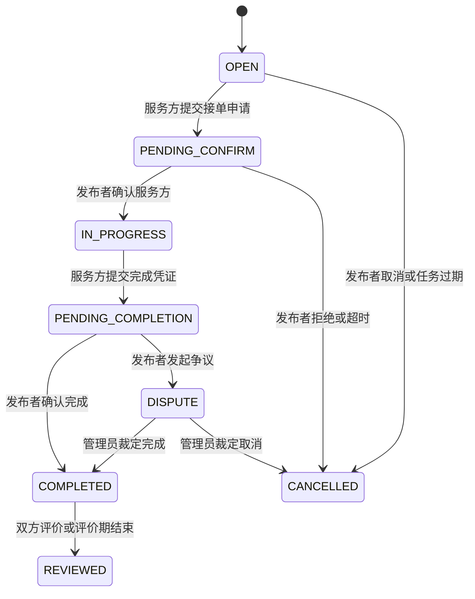
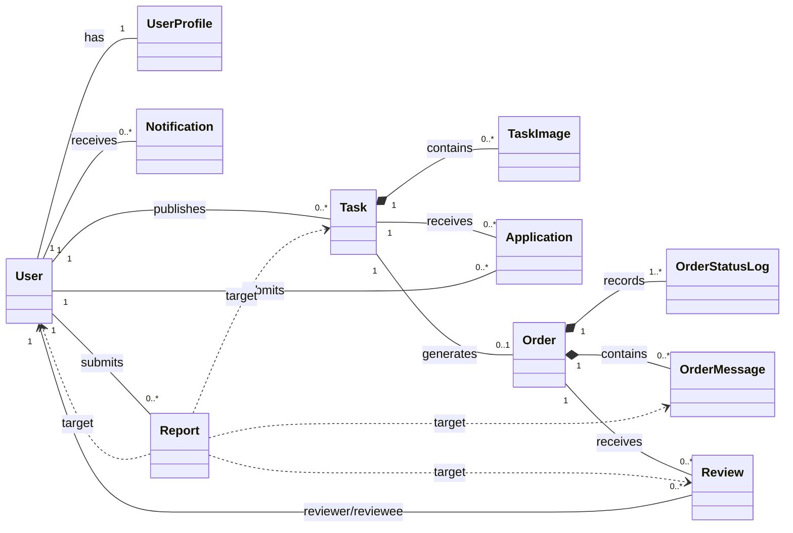

# CampusHub 详细设计文档（整合版）

**团队：** 暴风星云裂  
**项目：** CampusHub  
**阶段：** P3 详细设计  
**日期：** 2026年5月17日  

---

## 1. 文档目的与设计范围

本文档是 Phase 3 的整合版详细设计，基于 P1 需求分析、P2 架构设计以及 P3 已完成的类图、SOLID 检查、API 规范、ER 图和建表 SQL 整理而成。详细交付物如下：

- 类图：[01-class-diagram.md](01-class-diagram.md)
- SOLID 检查清单：[02-solid-checklist.md](02-solid-checklist.md)
- API 规范文档：[03-api-specification.md](03-api-specification.md)
- OpenAPI 文件：[03-api-specification.yaml](03-api-specification.yaml)
- ER 图：[04-er-diagram.md](04-er-diagram.md)
- 建表 SQL：[04-database-ddl.sql](04-database-ddl.sql)

本阶段设计覆盖 CampusHub MVP 的核心业务闭环：

`注册登录 -> 校园身份认证 -> 发布需求 -> 接单申请 -> 发布者确认 -> 订单执行 -> 订单内交流 -> 完成确认 -> 双向评价 -> 举报审核`

## 2. 设计依据

### 2.1 P1 需求边界

P1 需求规格说明书明确 CampusHub 是面向南京大学在校学生的轻量校园互助服务平台，首版重点解决“信息碎片化、匹配效率低、缺乏信任机制”的问题。核心需求包括：

| 需求范围 | 关键内容 |
|----------|----------|
| 用户与认证 | 学校邮箱注册、登录、邮箱验证、校园身份认证、个人资料维护 |
| 需求发布 | 支持 8 类互助需求，包含通用字段和分类差异化字段 |
| 任务大厅 | 按分类、校区、关键词、发布时间和截止时间浏览筛选 |
| 接单与订单 | 接单申请、发布者确认、订单状态流转、完成凭证、取消与争议 |
| 消息通知 | 系统通知、订单内文字和图片交流、未读提醒 |
| 评价信用 | 订单完成后双向评价，信用分流水记录 |
| 举报审核 | 用户举报违规内容，管理员处理并记录结果 |
| 基础后台 | 用户管理、需求管理、订单管理、举报处理、公告管理 |

P1 同时明确不实现在线支付、推荐算法、复杂数据看板、完整即时通讯、校园地图定位和多学校部署。P3 的类、接口和数据库设计均遵守这一范围。

### 2.2 P2 架构约束

P2 已接受的架构决策为：前端 Vue3 + TypeScript，后端 Java 17 + Spring Boot 3.x，数据库 MySQL 8.0，采用前后端分离的分层单体架构。MVP 阶段不引入 Redis、消息队列、API Gateway、Elasticsearch 等中间件。

后端分层约束如下：

| 层次 | 主要职责 |
|------|----------|
| Controller | 接收 HTTP 请求、参数校验、鉴权入口、统一响应 |
| Service | 处理业务规则、事务边界、状态流转、跨模块协作 |
| Mapper/Repository | 封装 SQL 与数据访问 |
| Domain/Entity | 表达核心业务对象和枚举状态 |
| Infrastructure | JWT、文件、邮件、WebSocket、定时任务、统一异常 |

关键约束：

- Controller 不直接访问数据库。
- 订单状态统一由 `OrderService` 处理，其他模块不得绕过业务规则直接修改订单状态。
- 管理后台通过各业务模块公开服务接口完成管理动作。
- 系统通知写入 `notification` 表；订单聊天消息写入 `order_message` 表。
- 所有列表接口分页，默认每页 20 条，最大 50 条。

## 3. 模块详细设计

### 3.1 用户与认证模块

**目标：** 确保平台只面向已认证学生开放核心操作，同时保护用户隐私。

主要职责：

- 学校邮箱注册、登录、退出登录、重置密码。
- 发送和校验邮箱验证码。
- 维护用户角色、账号状态、连续登录失败次数和锁定时间。
- 维护用户资料、头像、常用校区、联系方式和展示开关。
- 对邮箱、联系方式等敏感信息做前台脱敏。

核心类和表：

| 类/表 | 说明 |
|-------|------|
| `User` / `user` | 用户认证、角色、账号状态和校园认证状态 |
| `UserProfile` / `user_profile` | 用户展示资料和联系方式 |
| `verification_code` | 注册验证和密码重置验证码 |

关键规则：

- 未认证用户仅可浏览公开需求，不可发布、接单或发送消息。
- 密码只保存 BCrypt 哈希，不保存明文。
- 邮箱仅用于认证和后台校验，前台展示脱敏邮箱。
- 账号禁用后禁止发布、接单、发送消息和评价。

### 3.2 需求与任务大厅模块

**目标：** 支持学生快速发布和浏览多类型互助需求。

主要职责：

- 发布、编辑、删除未接单需求。
- 维护 8 类需求：快递代取、跑腿代办、学习辅导、二手交易、失物招领、咨询问答、组队搭子、其他。
- 支持分类、校区、关键词、状态、排序和分页查询。
- 支持匿名发布、需求配图、收藏。
- 控制敏感字段可见性，例如取件码仅在订单确认后对服务方展示。

核心类和表：

| 类/表 | 说明 |
|-------|------|
| `Task` / `task` | 需求主表，保存通用字段和状态 |
| `TaskImage` / `task_image` | 需求配图 |
| `favorite` | 用户收藏需求的中间表 |

分类差异化设计：

- `task` 表使用 `category_fields JSON` 存储分类专属字段。
- 业务层使用策略模式校验不同分类字段。
- MVP 阶段不对 JSON 内部字段建索引，避免过度设计。

### 3.3 接单与订单模块

**目标：** 管理从接单申请到订单完成的核心交易闭环。

主要职责：

- 服务方对开放需求提交接单申请。
- 发布者查看申请并确认一名服务方。
- 确认后生成订单，自动拒绝其他待处理申请。
- 维护订单状态流转和状态变更日志。
- 支持完成凭证、发布者确认完成、取消和争议入口。

核心类和表：

| 类/表 | 说明 |
|-------|------|
| `Application` / `application` | 接单申请 |
| `Order` / `orders` | 订单主记录，表名使用 `orders` 避免 SQL 保留字 |
| `OrderStatusLog` / `order_status_log` | 订单状态变更日志 |

订单状态流转：



并发控制：

- `task.version` 和 `orders.version` 作为乐观锁版本号。
- 确认接单时使用事务处理申请状态、任务状态、订单创建和通知写入。
- 若乐观锁更新失败，返回“任务已被其他用户接走”。

### 3.4 消息通知模块

**目标：** 满足订单执行中的轻量交流和关键状态提醒。

主要职责：

- 接单申请、订单状态变化、评价邀请、举报结果等系统通知。
- 订单内文字和图片消息。
- 未读通知数、通知已读、通知删除。
- WebSocket 订单聊天连接鉴权和消息推送。

核心类和表：

| 类/表 | 说明 |
|-------|------|
| `Notification` / `notification` | 系统通知 |
| `OrderMessage` / `order_message` | 订单内聊天消息 |

设计取舍：

- 系统通知采用数据库表 + HTTP 查询，不引入消息队列。
- 订单聊天只面向订单双方，不做群聊、语音、视频、位置共享。
- 消息先落库，再通过 WebSocket 推送，避免只推送不持久化导致消息丢失。

### 3.5 评价与信用模块

**目标：** 通过评价和信用分建立校园互助中的信任机制。

主要职责：

- 订单完成后 7 天内双方可提交评价。
- 每位用户对同一订单只能评价一次。
- 根据信用规则写入信用分流水。
- 展示用户信用分、完成单数、好评率和评价记录。

核心类和表：

| 类/表 | 说明 |
|-------|------|
| `Review` / `review` | 订单评价 |
| `credit_log` | 信用分变动流水 |

关键规则：

- 只有 `COMPLETED` 状态订单可评价。
- `review` 表使用 `uk_review(order_id, reviewer_id)` 防止重复评价。
- 信用分采用流水记录，不在 `user_profile` 中保存冗余快照，避免数据不一致。

### 3.6 举报审核与后台管理模块

**目标：** 通过人工审核维护平台秩序，处理违规内容和争议。

主要职责：

- 用户举报需求、订单消息、评价或用户。
- 管理员查看举报列表和详情。
- 管理员处理举报，执行下架、警告、禁用、扣信用分等措施。
- 管理员管理用户、需求、订单、公告。
- 记录管理员操作审计日志。

核心类和表：

| 类/表 | 说明 |
|-------|------|
| `Report` / `report` | 举报记录 |
| `announcement` | 系统公告 |
| `admin_operation_log` | 管理员操作审计 |

举报目标设计：

- `Report` 使用 `target_type + target_id` 表达通用举报目标。
- 业务层不能把所有目标处理逻辑塞进一个大方法，应按目标类型拆分处理器。
- 管理员处理结果通过系统通知反馈给举报人。

### 3.7 文件上传模块

**目标：** 支撑头像、需求配图、订单凭证、聊天图片和举报证据。

主要职责：

- 校验文件类型、大小和用途。
- 保存文件 URL、原始文件名、大小、上传者和用途。
- 返回文件 ID 和 URL，供业务表关联使用。

核心表：

| 表 | 说明 |
|----|------|
| `file_record` | 文件上传记录 |

首版文件可存储在本地目录或免费对象存储，数据库只保存元数据和可访问 URL。

## 4. 核心类设计

P3 类图围绕主业务链路建模，核心对象如下：

| 类 | 核心职责 | 关键关系 |
|----|----------|----------|
| `User` | 表示平台用户、角色、状态和认证状态 | 拥有 `UserProfile`，发布 `Task`，提交 `Application`、`Review`、`Report` |
| `UserProfile` | 保存昵称、头像、校区、联系方式等展示资料 | 与 `User` 一对一 |
| `Task` | 表示用户发布的互助需求 | 包含 `TaskImage`，接收 `Application`，确认后生成 `Order` |
| `Application` | 表示服务方的接单申请 | 关联一个 `Task` 和一个申请用户 |
| `Order` | 表示任务执行记录和状态流转中心 | 关联 `Task`、发布者、服务方、状态日志、消息、评价 |
| `OrderStatusLog` | 记录订单状态变更历史 | 隶属于 `Order` |
| `OrderMessage` | 订单内聊天消息 | 隶属于 `Order`，关联发送者 |
| `Notification` | 系统通知 | 关联接收用户 |
| `Review` | 订单完成后的评价 | 关联订单、评价者、被评价者 |
| `Report` | 用户举报记录 | 关联举报人和通用举报目标 |

简化关系图：



类图第一版没有展开验证码、收藏、公告、操作日志等扩展类，但数据库和 API 已为这些 MVP 辅助功能补充对应表和接口。

## 5. 设计模式应用

### 5.1 策略模式：需求分类校验

不同需求类别的专属字段和校验规则不同。例如快递代取需要取件地点和取件码，二手交易需要价格和新旧程度，失物招领需要地点、时间和物品特征。

设计方案：

| 组件 | 职责 |
|------|------|
| `TaskCategoryValidator` | 定义分类校验接口 |
| `ExpressTaskValidator` | 校验快递代取字段 |
| `SecondHandTaskValidator` | 校验二手交易字段 |
| `LostFoundTaskValidator` | 校验失物招领字段 |
| `TaskCategoryValidatorRegistry` | 根据 `TaskCategory` 选择校验策略 |

使用原因：

- 避免在 `TaskService` 中写超长 `if-else`。
- 新增需求类别时新增策略类即可，减少对旧代码的修改。
- 与 SOLID 中的开闭原则和单一职责原则一致。

如果不用策略模式，任务发布和编辑逻辑会随着类别增加不断膨胀，后续新增类别时必须修改核心服务，回归风险较高。

### 5.2 工厂模式：系统通知创建

CampusHub 中存在接单申请通知、订单状态变更通知、评价邀请通知、举报处理结果通知。它们都落到 `notification` 表，但标题、内容、接收人和关联对象不同。

设计方案：

| 组件 | 职责 |
|------|------|
| `NotificationFactory` | 根据通知类型创建通知对象 |
| `ApplicationNotificationFactory` | 生成接单申请通知 |
| `OrderStatusNotificationFactory` | 生成订单状态通知 |
| `ReviewNotificationFactory` | 生成评价邀请通知 |
| `ReportResultNotificationFactory` | 生成举报处理结果通知 |

使用原因：

- 通知格式集中管理，便于统一文案和字段。
- 避免 `OrderService`、`ReviewService`、`ReportService` 到处手写通知构造逻辑。
- 新增通知类型时扩展点清晰。

如果不用工厂模式，通知创建逻辑会散落在多个服务中，文案和字段容易不一致。

## 6. SOLID 检查与约束

本阶段 SOLID 检查没有发现已经落地的严重违背，但识别出 3 类实现阶段风险：

| 原则 | 检查结论 | 约束方案 |
|------|----------|----------|
| S - 单一职责 | `Order` / `OrderService` 容易承担过多职责 | 订单状态由 `OrderService` 负责，聊天、通知、评价、举报分别交给独立服务 |
| O - 开闭原则 | 需求类别差异逻辑可能演变为大分支 | 使用分类校验策略，新增类别时新增策略类 |
| L - 里氏替换 | 当前没有复杂继承，未发现问题 | 继续避免为了 UML 好看而强行继承 |
| I - 接口隔离 | 服务接口后续可能过胖 | 拆分 `ApplicationService`、`OrderService`、`ChatService`、`NotificationService` |
| D - 依赖倒置 | 类图阶段未暴露明显问题 | Controller 依赖 Service 接口，业务层不直接依赖数据库细节 |

核心判断：P3 设计不追求“复杂面向对象结构”，而是保持业务边界清晰，优先防止订单服务、任务服务和举报服务在实现阶段失控。

## 7. API 设计

### 7.1 基础约定

| 项目 | 设计 |
|------|------|
| 基础路径 | `/api` |
| 协议 | HTTPS |
| 请求/响应格式 | JSON，文件上传使用 `multipart/form-data` |
| 认证方式 | JWT，`Authorization: Bearer <token>` |
| WebSocket | `/ws/orders/{orderId}/chat` |

统一成功响应：

```json
{
  "code": 0,
  "message": "success",
  "data": {}
}
```

统一错误响应：

```json
{
  "code": 40001,
  "message": "未登录或 Token 已过期",
  "data": null
}
```

### 7.2 核心接口总览

| 模块 | 方法与路径 | 说明 |
|------|------------|------|
| 认证 | `POST /api/auth/register` | 学校邮箱注册 |
| 认证 | `POST /api/auth/login` | 登录并返回 JWT |
| 认证 | `POST /api/auth/verify-email` | 校验邮箱验证码 |
| 用户 | `GET /api/users/me` | 获取当前用户资料 |
| 用户 | `PATCH /api/users/me` | 修改个人资料 |
| 任务 | `GET /api/tasks` | 任务大厅列表，支持筛选、搜索、排序和分页 |
| 任务 | `POST /api/tasks` | 发布需求 |
| 任务 | `GET /api/tasks/{taskId}` | 查看需求详情 |
| 接单 | `POST /api/tasks/{taskId}/applications` | 发起接单申请 |
| 接单 | `POST /api/applications/{applicationId}/confirm` | 发布者确认接单并生成订单 |
| 订单 | `GET /api/orders` | 我的订单列表 |
| 订单 | `GET /api/orders/{orderId}` | 查看订单详情 |
| 订单 | `POST /api/orders/{orderId}/complete` | 服务方提交完成凭证 |
| 订单 | `POST /api/orders/{orderId}/confirm-completion` | 发布者确认完成 |
| 消息 | `GET /api/notifications` | 通知列表 |
| 消息 | `POST /api/orders/{orderId}/messages` | 发送订单内文字消息 |
| 消息 | `POST /api/orders/{orderId}/messages/image` | 发送订单内图片消息 |
| 评价 | `POST /api/orders/{orderId}/reviews` | 提交评价 |
| 举报 | `POST /api/reports` | 提交举报 |
| 文件 | `POST /api/files/upload` | 上传图片 |
| 后台 | `GET /api/admin/users` | 管理员用户列表 |
| 后台 | `POST /api/admin/reports/{reportId}/handle` | 管理员处理举报 |

详细请求参数、响应结构和错误码见 [03-api-specification.md](03-api-specification.md) 和 [03-api-specification.yaml](03-api-specification.yaml)。

### 7.3 错误码设计

错误码按模块分段：

| 范围 | 模块 |
|------|------|
| `40000-40009` | 通用错误 |
| `40010-40039` | 认证模块 |
| `40100-40119` | 需求模块 |
| `40200-40219` | 订单模块 |
| `40400-40409` | 评价模块 |
| `40500-40509` | 文件模块 |

业务错误通过响应体 `code` 表示；HTTP 状态码主要表达协议层错误，如 401 未登录、403 权限不足、404 路径不存在、500 未捕获异常。

## 8. 数据库设计

### 8.1 数据库总体结构

数据库采用 MySQL 8.0，字符集 `utf8mb4`，存储引擎 InnoDB。核心表共 17 张：

| 分类 | 表 |
|------|----|
| 用户认证 | `user`、`user_profile`、`verification_code` |
| 需求 | `task`、`task_image`、`favorite` |
| 接单订单 | `application`、`orders`、`order_status_log` |
| 消息通知 | `order_message`、`notification` |
| 评价信用 | `review`、`credit_log` |
| 举报审核 | `report` |
| 基础设施 | `file_record`、`announcement`、`admin_operation_log` |

### 8.2 关系映射

| 关系 | 实现方式 |
|------|----------|
| `User` 与 `UserProfile` 一对一 | `user_profile.user_id` 唯一外键 |
| `User` 与 `Task` 一对多 | `task.publisher_id` |
| `Task` 与 `TaskImage` 一对多 | `task_image.task_id` |
| `Task` 与 `Application` 一对多 | `application.task_id` |
| `Task` 与 `Order` 一对零或一 | `orders.task_id` 唯一索引 |
| `Order` 与 `OrderStatusLog` 一对多 | `order_status_log.order_id` |
| `Order` 与 `OrderMessage` 一对多 | `order_message.order_id` |
| `Order` 与 `Review` 一对多 | `review.order_id` |
| `User` 与 `Task` 收藏多对多 | `favorite(user_id, task_id)` |

### 8.3 关键索引

| 表 | 索引 | 目的 |
|----|------|------|
| `user` | `uk_email` | 注册查重和登录查询 |
| `task` | `idx_task_hall(status, category, campus)` | 任务大厅筛选 |
| `task` | `idx_task_sort_latest(status, created_at)` | 按最新发布排序 |
| `task` | `idx_task_sort_deadline(status, deadline)` | 按截止时间排序 |
| `application` | `idx_app_task(task_id, status)` | 发布者查看某需求申请 |
| `orders` | `idx_order_publisher(publisher_id, status)` | 我发布的订单列表 |
| `orders` | `idx_order_provider(service_provider_id, status)` | 我接单的订单列表 |
| `orders` | `uk_order_task(task_id)` | 一个任务只生成一个订单 |
| `order_message` | `idx_om_order_time(order_id, created_at)` | 聊天记录分页 |
| `notification` | `idx_notif_receiver(receiver_id, is_read, created_at)` | 通知列表和未读筛选 |
| `review` | `uk_review(order_id, reviewer_id)` | 防止重复评价 |
| `report` | `idx_report_admin(status, created_at)` | 管理员举报列表 |

### 8.4 数据安全设计

- 密码只存储 BCrypt 哈希。
- 邮箱、联系方式等敏感字段前台脱敏展示。
- 取件码等分类敏感字段只在订单确认后向服务方展示。
- 管理员操作写入 `admin_operation_log`。
- 文件表只保存 URL 和元数据，不把二进制文件写入业务表。

## 9. 非功能设计

### 9.1 安全性

- 使用 Spring Security + JWT 保护受限接口。
- 已认证学生才能发布、接单、发送消息、评价和举报。
- 管理后台接口必须校验 `ADMIN` 角色。
- 参数校验使用 Bean Validation，避免非法输入进入业务层。
- 前端展示用户敏感信息时默认脱敏。

### 9.2 可靠性

- 订单状态变更必须在事务中完成。
- 每次状态变更写入 `order_status_log`。
- 接单确认使用乐观锁避免并发抢单。
- 文件上传失败时不创建业务关联。
- 举报和管理员操作均保留处理记录。

### 9.3 性能

- 所有列表接口分页，默认 20 条，最大 50 条。
- 高频查询路径建立联合索引。
- MVP 阶段使用 MySQL LIKE 做标题和描述关键词搜索，不引入搜索引擎。
- 不提前引入缓存，避免缓存一致性和部署复杂度。

### 9.4 可维护性

- 后端按用户、任务、订单、消息、评价、举报、后台、文件等模块划分。
- Controller、Service、Mapper 分层。
- 类别校验和举报目标处理通过策略或处理器扩展。
- API 文档同步维护 Markdown 和 OpenAPI YAML 两种形式，方便阅读和联调。

## 10. 关键工程决策

| 决策 | 内容 | 理由 |
|------|------|------|
| 架构 | 分层单体，不采用微服务 | 3 人团队、10 周 MVP、200 并发目标下更可控 |
| 数据库 | MySQL 8.0 单库 | 支持事务，部署简单，符合 P2 ADR |
| 通知 | 数据库通知表 + 查询 | 通知量小，不需要消息队列 |
| 聊天 | Spring WebSocket + 消息落库 | 满足订单双方实时交流，不做完整 IM |
| 分类字段 | `task.category_fields JSON` | 避免宽表和频繁 DDL，MVP 不按 JSON 内部字段检索 |
| 订单一致性 | `OrderService` 统一状态流转 | 防止不同模块绕过规则直接改状态 |
| 信用分 | 使用 `credit_log` 流水 | 保留变更原因，避免资料表冗余分数不一致 |

## 11. 验收对应关系

| P3 验收标准 | 本文档对应位置 |
|-------------|----------------|
| 类图覆盖核心模块，标注属性和方法 | 第 4 节，详见 `01-class-diagram.md` |
| SOLID 检查清单完整 | 第 6 节，详见 `02-solid-checklist.md` |
| API 覆盖至少 6 个核心接口 | 第 7 节，详见 `03-api-specification.md` |
| ER 图清晰，SQL 可执行 | 第 8 节，详见 `04-er-diagram.md` 和 `04-database-ddl.sql` |
| 至少应用 2 种设计模式 | 第 5 节 |
| 反思日志 #3 有实质内容 | 见 `06-ai-collaboration-reflection-log3.md` |

## 12. 后续实现建议

1. 优先实现用户认证、任务大厅、发布需求、接单申请、确认接单、订单详情这条主链路。
2. 订单状态流转先写单元测试，再写 Controller 接口。
3. 分类校验策略先覆盖快递代取、二手交易、失物招领、组队搭子，其余类别可使用通用校验。
4. 通知工厂先实现接单申请、订单状态、评价邀请和举报结果 4 类。
5. 管理后台首版聚焦举报处理和用户禁用，不扩展复杂数据分析。
