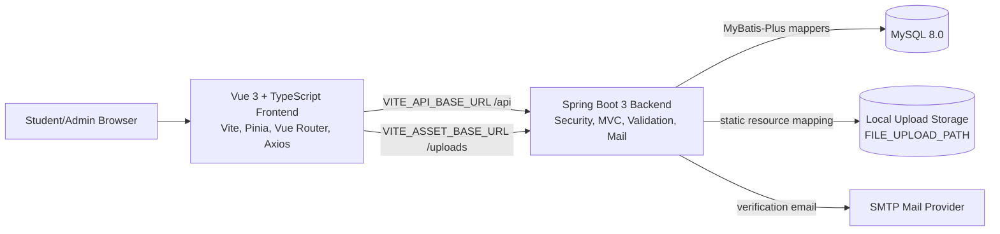
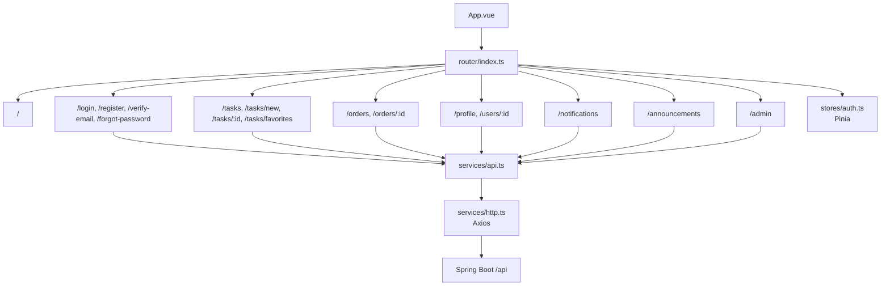
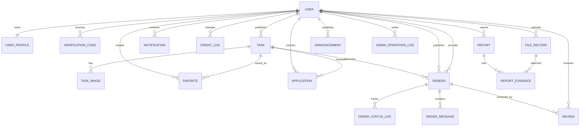
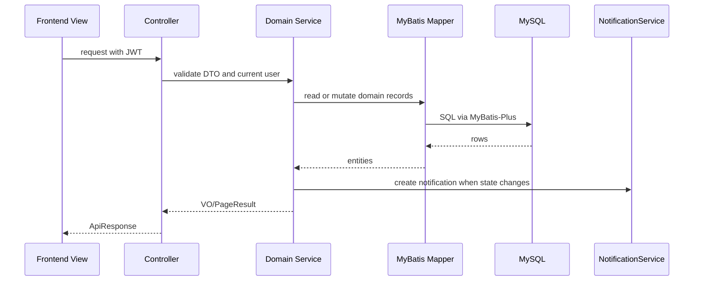

# CampusHub Architecture Graph

Generated from the current project structure with `/graphify .`.

## System Context

## Backend Layers

```mermaid
flowchart TB
  subgraph API[Controller Layer]
    AuthController
    UserController
    TaskController
    OrderController
    ReportController
    NotificationController
    FileController
    AnnouncementController
    AdminController
  end

  subgraph Service[Service Layer]
    AuthServiceImpl
    UserServiceImpl
    TaskService
    OrderService
    ReportService
    NotificationService
    FileService
    AdminService
    EmailService
    TokenBlacklistService
    JwtTokenProvider
  end

  subgraph Persistence[Mapper Layer]
    UserMapper
    UserProfileMapper
    VerificationCodeMapper
    TaskMapper
    TaskImageMapper
    FavoriteMapper
    ApplicationMapper
    OrderMapper
    OrderStatusLogMapper
    OrderMessageMapper
    NotificationMapper
    ReviewMapper
    CreditLogMapper
    ReportMapper
    ReportEvidenceMapper
    FileRecordMapper
    AnnouncementMapper
    AdminOperationLogMapper
  end

  AuthController --> AuthServiceImpl
  UserController --> UserServiceImpl
  TaskController --> TaskService
  OrderController --> OrderService
  ReportController --> ReportService
  NotificationController --> NotificationService
  FileController --> FileService
  AnnouncementController --> AdminService
  AdminController --> AdminService
  AdminController --> ReportService

  AuthServiceImpl --> UserMapper
  AuthServiceImpl --> UserProfileMapper
  AuthServiceImpl --> VerificationCodeMapper
  AuthServiceImpl --> JwtTokenProvider
  AuthServiceImpl --> TokenBlacklistService
  AuthServiceImpl --> EmailService

  UserServiceImpl --> UserMapper
  UserServiceImpl --> UserProfileMapper
  UserServiceImpl --> FileService
  UserServiceImpl --> ReviewMapper
  UserServiceImpl --> CreditLogMapper
  UserServiceImpl --> OrderMapper

  TaskService --> TaskMapper
  TaskService --> TaskImageMapper
  TaskService --> ApplicationMapper
  TaskService --> OrderMapper
  TaskService --> OrderStatusLogMapper
  TaskService --> UserProfileMapper
  TaskService --> FavoriteMapper
  TaskService --> CreditLogMapper
  TaskService --> UserMapper
  TaskService --> NotificationService
  TaskService --> FileService

  OrderService --> OrderMapper
  OrderService --> TaskMapper
  OrderService --> UserProfileMapper
  OrderService --> OrderStatusLogMapper
  OrderService --> OrderMessageMapper
  OrderService --> ReviewMapper
  OrderService --> CreditLogMapper
  OrderService --> NotificationService
  OrderService --> FileService

  ReportService --> ReportMapper
  ReportService --> ReportEvidenceMapper
  ReportService --> TaskMapper
  ReportService --> NotificationService
  ReportService --> FileService

  NotificationService --> NotificationMapper
  FileService --> FileRecordMapper

  AdminService --> UserMapper
  AdminService --> UserProfileMapper
  AdminService --> CreditLogMapper
  AdminService --> AdminOperationLogMapper
  AdminService --> AnnouncementMapper
  AdminService --> TaskMapper
  AdminService --> OrderMapper
  AdminService --> ReportMapper
```

## Frontend Routes

## Data Model

## High-Traffic Domain Flow

## Source Hotspots

- Backend entrypoint: `backend/src/main/java/com/campushub/CampusHubApplication.java`
- Backend API layer: `backend/src/main/java/com/campushub/controller`
- Backend business layer: `backend/src/main/java/com/campushub/service`
- Backend persistence layer: `backend/src/main/java/com/campushub/mapper`
- Backend database schema: `database/01-schema.sql`
- Frontend entrypoint: `frontend/src/main.ts`
- Frontend routes: `frontend/src/router/index.ts`
- Frontend API client: `frontend/src/services/api.ts` and `frontend/src/services/http.ts`
